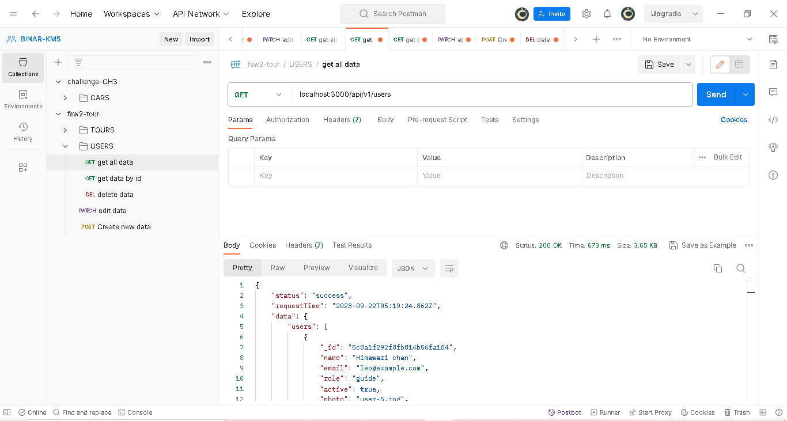
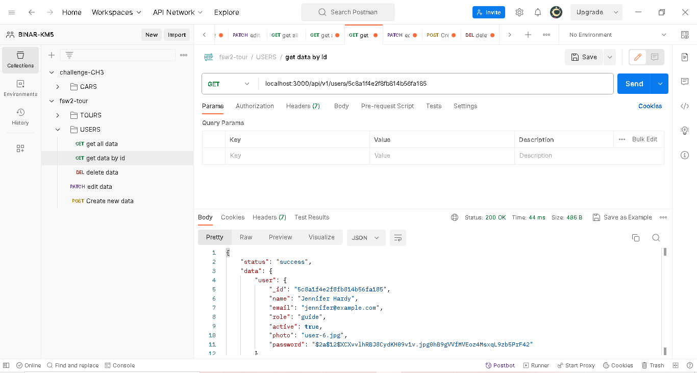
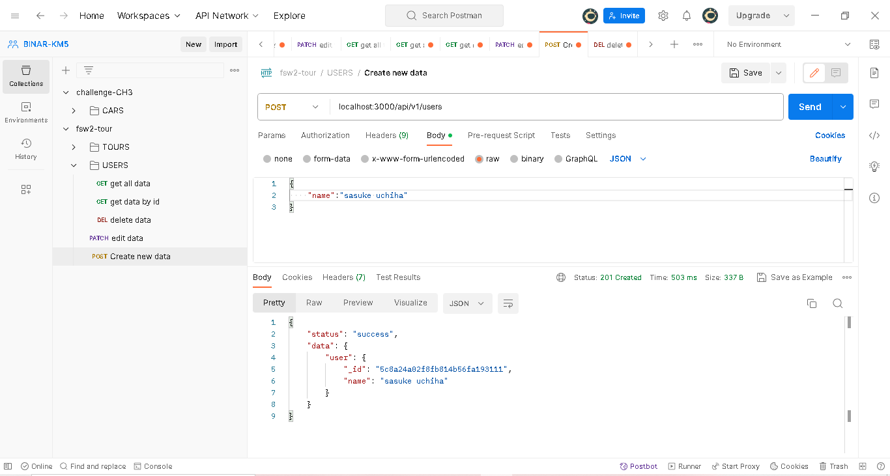
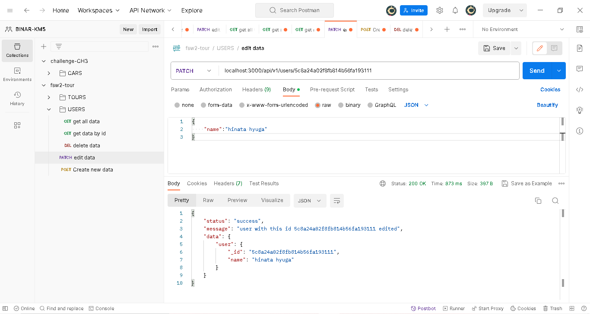
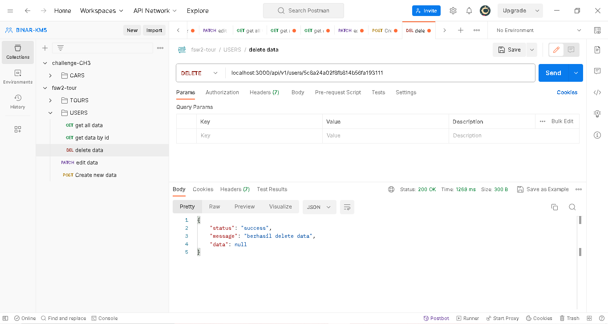

1. Request ke endpoint get all data
   

2. Request ke endpoint get data by id
   

3. Request ke endpoint create new data
   

4. Request ke endpoint edit data
   

5. Request ke endpoint delete data
   
